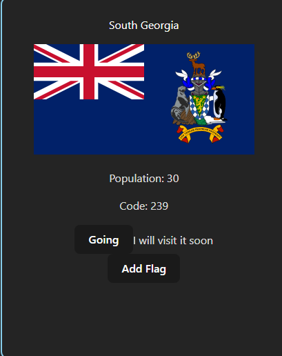
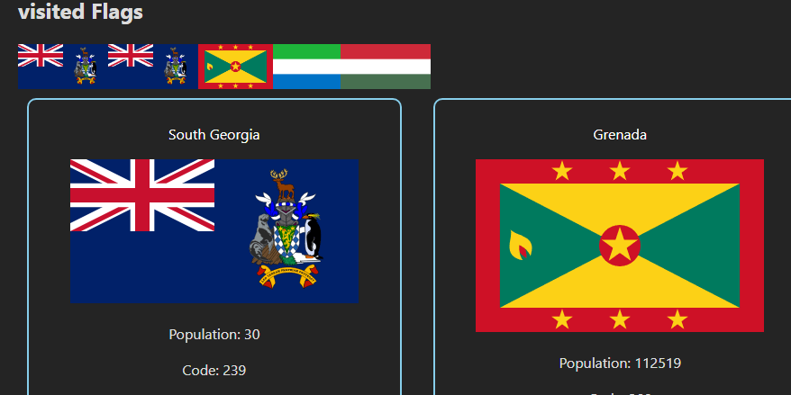

<h1>How Flag are going to be added </h1>

<ol>
    <li> <button onClick={()=>handleFlagClicked(flagUrl)}>Add Flag</button></li>
    <li> const handleFlagClicked = (flagUrl) =>{
        visitedFlag(flagUrl);
    }</li>
    <li> const visitedFlag = (flagUrl) => {
        const newFlags = [...flags, flagUrl];
        setFlags(newFlags);
    }</li>
    <li>  

                {
                    countries.map((country) => (
                        <Country
                            key={country.ccn3}
                            visitedFlag={visitedFlag}
                            addVisitedCountry={addVisitedCountry}
                            code={country.ccn3}
                            country={country}
                        />
                    ))
                }
            
</li>
    <li>const [flags, setFlags] = useState([]);</li>
    <li> 

                <h2>visited Flags</h2>
                

                    {
                        flags.map((flag,index) => {
                            return 
                        })
                    }
                

            
</li>
</ol>
